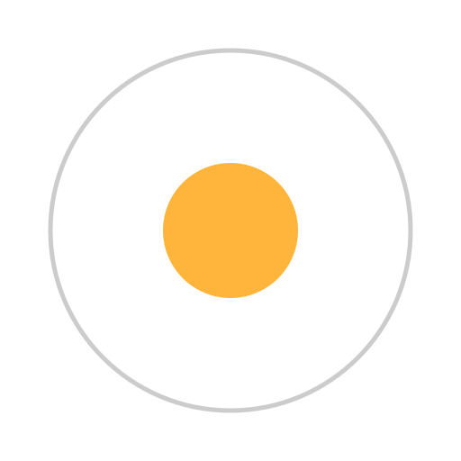
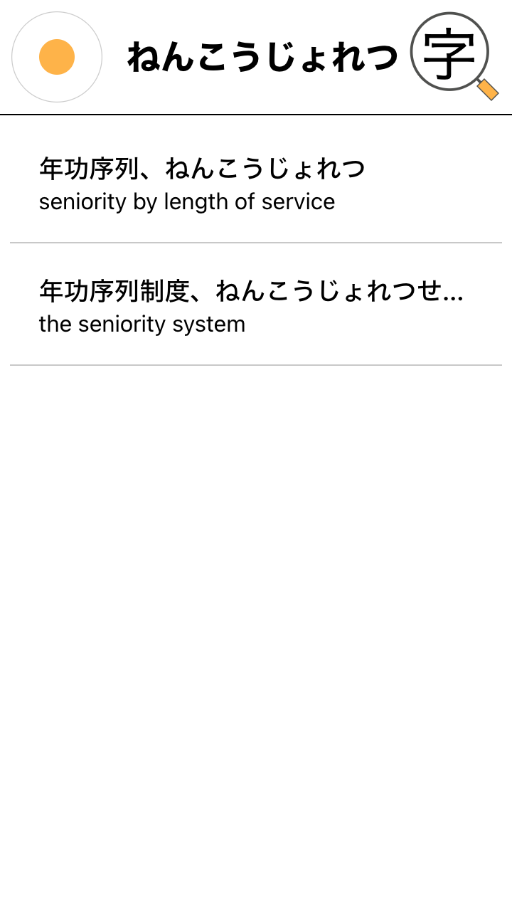
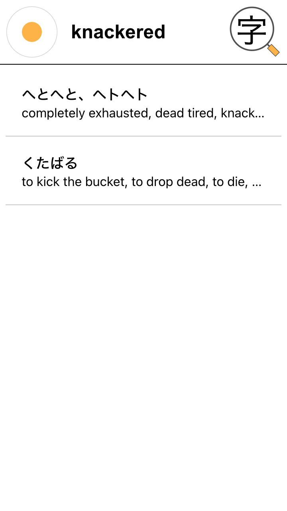
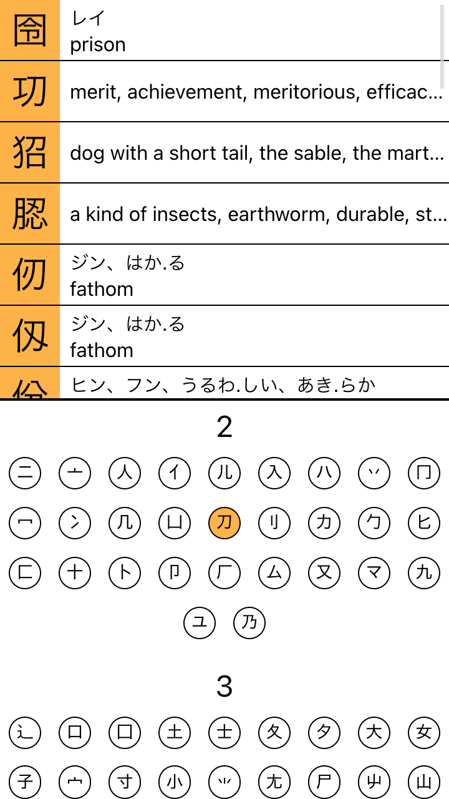
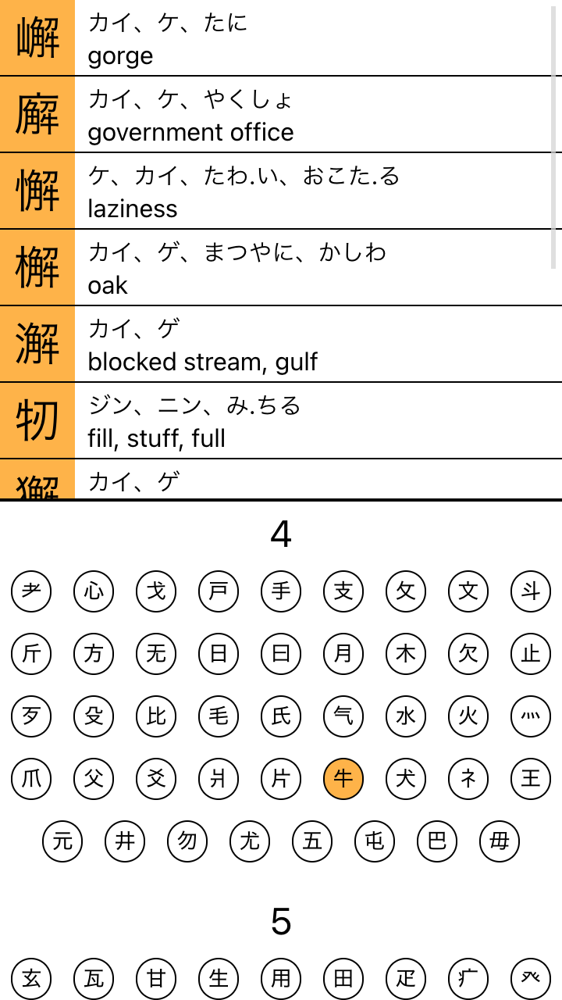
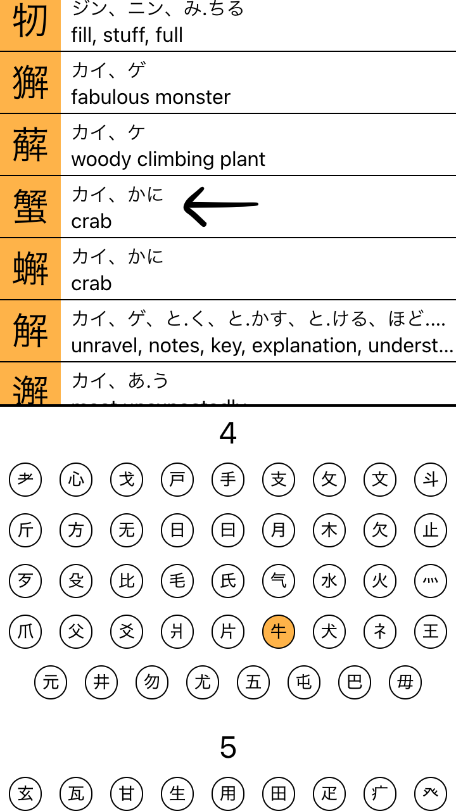

This web application uses the
[JMdict/EDICT](http://www.edrdg.org/wiki/index.php/JMdict-EDICT_Dictionary_Project)
and [KANJIDIC](http://www.edrdg.org/wiki/index.php/KANJIDIC_Project) dictionary
files, and the
[kradfile-u](http://ftp.monash.edu.au/pub/nihongo/kradfile-u-hdr). These files
are the property of the [Electronic Dictionary Research and Development
Group](http://www.edrdg.org/), and are used in conformance with the Group's
[licence](http://www.edrdg.org/edrdg/licence.html).

# Kamatama Jisho

I have used the [Takoboto](http://takoboto.jp/) android app for several years.
It is a very good dictionary for many use cases:

- It has a kanji search by radicals.
- Searching can be done in Japanese with any combination of different scripts;
  Kanji, Hiragana, Katakana and Romaji.
- Searching can also be done in English.
- All searches are entered into the same single input, leading to a very simple
  design.

I have recently become restless with the lack of modernism in the app's
development though. I believe there are several drawbacks to the app:

- It is not available on Apple's App Store.
- It is not particularly aesthetically pleasing.
- The web version of the app is not available offline.

Frustration with the above drew me to develop this app. This app is based on the
exact same dictionaries as takoboto, but is intended to be installed as a PWA
([Progresive Web
App](https://developer.mozilla.org/en-US/docs/Web/Progressive_web_apps)). The
PWA will be installable and will provide offline functionaloty, straight from
the browser.

_**NOTE:** Due to the problems associated with romanisation of Japanese (e.g.
should スーパー be supa, suupaa, su-pa- or some combination of these?), this
dictionary is intended for use by people who have studied some Japanese and can
at least read hiragana. If you don't know hiragana yet, [this
guide](https://www.tofugu.com/japanese/learn-hiragana/) on the [tofugu
blog](https://www.tofugu.com/) is a great place to start._

## Installation

Whe you first navigat to the page, assuming your device is capable of running
the app, you will be greeted with a big hello and a large pulsating egg.

If you click the egg, several things will happen:

- The dictionary files (~10MB) will download.
- The dictionary files will be decompressed.
- The decompressed dictionaries will be inserted into your
  [local
  database](https://developer.mozilla.org/en-US/docs/Web/API/IndexedDB_API).

Since the dictionaries are quite large, this will probably take around 3
minutes.

Please note the following:

- If you close the tab that is installing the data, it will have to be run
  again. (If the dictionary files had finished downloading, they will have been
  cached)
- If you don't close the tab, but navigate away from it (e.g. go to a different
  tab, or minimise the browser etc.) then your browser may pause the
  installation.

### For Safari Users

If you are using Safari, and you intend to install the app as a
[PWA](https://developer.mozilla.org/en-US/docs/Web/Progressive_web_apps), Safari
does not share local storage between the browser and the PWA versions of the
app. Please add to your homescreen **_first_**, and then install the app from
there.

Safari also has a cache eviction policy, so if you do not use the app for more
than 30 days, you will have to install the dictionaries again.

## Usage

Google translate is great for daily use, but often has trouble translating set
phrases or giving multiple opinions on translation.

### Japanese and English Phrases

You can search for both Japanese words and english words in the same place!

<table>
<tr>
<td>

</td>
<td>

</td>
</tr>
</table>

### Kanji Radical search

Kamatama makes use of the
[`kradfile-u`](http://ftp.monash.edu.au/pub/nihongo/kradfile-u-hdr) kanji
radical decompositions to search kanji by their radicals.

Lets try to search for 蟹.

I can see a couple of radicals in there.

I can see 刀, which has 2 strokes:

<!--  -->

And I can see 牛, which has 4 strokes:

<!--  -->

Just scroll down a bit...

<!--  -->

